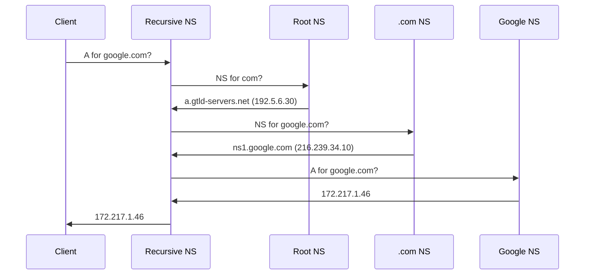
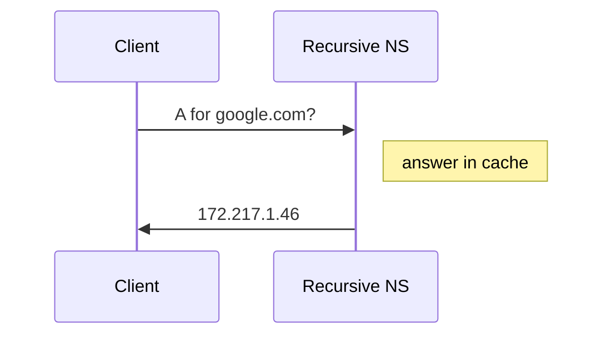

## Goal

Leverage frequency analysis to identify systems using DNS for C2.

## Tools Used

* dig
* Zeek
* Tshark
* Wireshark
* RITA

## Background

Many command & control (C2) channels communicate directly with an attacker-controlled system. This makes it easier to detect and track down. DNS based C2 is different as the communication utilizes the DNS infrastructure to communicate instead.

A normal DNS request for `google.com` goes like this:

__Non-Cached DNS Query__



Everything going on might not yet be clear, but there are two things to notice first.

1. The Client (your computer) only talks with its configured Recursive Name Server (NS). This name server is usually given to your computer when it connects to a network through DHCP. Though you can also set your DNS servers manually. For instance, you may choose to use one of the servers provided by large companies such as Cloudflare (1.1.1.1) or Google (8.8.8.8).

2. Behind the scenes, your Recursive NS is doing a lot of work for you. All these requests would quickly overwhelm servers if they were done every time so the above sequence of events only happens if your Recursive NS doesn't already know an answer. Once it has performed this work once it will cache the answer for a period of time. So the next time you or any other client makes the same DNS query the NS will answer from its local cache instead of querying other name servers.


__Cached DNS Query__



These two points are both very important when considering DNS as a C2 channel.

First, the Recursive NS is effectively acting to proxy traffic between the client and the remote name servers. Since DNS is so critical to normal network operations most networks will implicitly trust whichever recursive NS is configured with DHCP. Attackers exploit this trust to communicate out of restrictive networks.

Second, since a name server will cache results for subsequent requests attackers need to prevent caching in order to get the NS to communicate out with their C2 server. A name server will use its cache if it has answered an identical request recently. To get around this, attackers ensure that they never make identical requests. In practice, this means the more requests an attacker sends out the more unique subdomains they need to use. Defenders can use this behavior to detect C2 traffic over DNS.


### Exercise: Follow the Sequence of a DNS Query

Let's go through the above sequence diagram and understand each step that is happening. We will use the `dig` command to simulate what is going on behind the scenes.

Note: You may receive different IP addresses when you run these same commands. This is because large websites like Google will host their content on many different servers. They use the DNS results to both direct you to the closest geographical server and load balance so that no one server gets overloaded.

1. The client asks the recursive name server for `google.com`'s `A` record.

We'll make heavy use of `dig`'s `+norecurse` option to prevent the background requests that name servers will typically make on your behalf.

It's highly likely that your name server of choice already has an answer cached for `google.com`. You may have to try a few different domains before you find one that isn't cached. Here's an example using `do-not-respond.org`.

```bash
dig do-not-respond.org A +norecurse
```

__Output__
```
;; Got answer:
;; ->>HEADER<<- opcode: QUERY, status: SERVFAIL, id: 51547
;; flags: qr ra; QUERY: 1, ANSWER: 0, AUTHORITY: 0, ADDITIONAL: 1

;; OPT PSEUDOSECTION:
; EDNS: version: 0, flags:; udp: 1452
;; QUESTION SECTION:
;do-not-respond.org.		IN	A
```

You can see that there was no answer provided and the header shows `Answer: 0`.

Try the query again without the `+norecurse` flag.

```bash
dig do-not-respond.org A
```

__Output__
```
;; Got answer:
;; ->>HEADER<<- opcode: QUERY, status: NOERROR, id: 43574
;; flags: qr rd ra; QUERY: 1, ANSWER: 1, AUTHORITY: 0, ADDITIONAL: 1

;; OPT PSEUDOSECTION:
; EDNS: version: 0, flags:; udp: 1452
;; QUESTION SECTION:
;do-not-respond.org.		IN	A

;; ANSWER SECTION:
do-not-respond.org.	7200	IN	A	99.81.40.78
```

This time an answer was provided because your local resolver made the recursive calls for you. If we try the first command again with the `+norecurse` flag we'll see that the answer is now cached.

```bash
dig do-not-respond.org A +norecurse
```

__Output__
```
;; Got answer:
;; ->>HEADER<<- opcode: QUERY, status: NOERROR, id: 14157
;; flags: qr ra; QUERY: 1, ANSWER: 1, AUTHORITY: 0, ADDITIONAL: 1

;; OPT PSEUDOSECTION:
; EDNS: version: 0, flags:; udp: 1452
;; QUESTION SECTION:
;do-not-respond.org.		IN	A

;; ANSWER SECTION:
do-not-respond.org.	7198	IN	A	99.81.40.78

```

Let's explore what happens from the recursive name server's point of view if the result is not in the cache.

2. The recursive name server asks the root name server for the `com` `NS` record.

DNS infrastructure is set up in a tree hierarchy with 13 root name servers on the top. The IP addresses of the root name servers are [well known](https://en.wikipedia.org/wiki/Root_name_server#Root_server_addresses)  and rarely change. The recursive name server will have those already so that it knows where to send its next request.

The root name server will consult its zone file and return the `NS` record(s) for the `com` top level domain (TLD). The zone file can be found here: https://www.internic.net/zones/root.zone

It contains `NS` records for each of the TLDs (e.g. `com`, `net`, `org`, `shop`, `fitness`, etc.) and the `A` & `AAAA` records for each of the `NS` records. This is so that recursive resolvers will know the IP address(es) of the next name servers to query. Download the root zone file and see if you can find the entries for `com`'s name servers that `dig` shows us below.

`@198.41.0.4` tells `dig` to use that IP address as the name server to query, which is one of the root name servers. We're asking the name server for the `NS` record for `com`.

```bash
dig @198.41.0.4 com NS +norecurse
```

__Output__
```
;; QUESTION SECTION:
;com.				IN	NS

;; AUTHORITY SECTION:
com.			172800	IN	NS	e.gtld-servers.net.
com.			172800	IN	NS	b.gtld-servers.net.
com.			172800	IN	NS	j.gtld-servers.net.
com.			172800	IN	NS	m.gtld-servers.net.
com.			172800	IN	NS	i.gtld-servers.net.
com.			172800	IN	NS	f.gtld-servers.net.
com.			172800	IN	NS	a.gtld-servers.net.
com.			172800	IN	NS	g.gtld-servers.net.
com.			172800	IN	NS	h.gtld-servers.net.
com.			172800	IN	NS	l.gtld-servers.net.
com.			172800	IN	NS	k.gtld-servers.net.
com.			172800	IN	NS	c.gtld-servers.net.
com.			172800	IN	NS	d.gtld-servers.net.

;; ADDITIONAL SECTION:
e.gtld-servers.net.	172800	IN	A	192.12.94.30
e.gtld-servers.net.	172800	IN	AAAA	2001:502:1ca1::30
b.gtld-servers.net.	172800	IN	A	192.33.14.30
b.gtld-servers.net.	172800	IN	AAAA	2001:503:231d::2:30
j.gtld-servers.net.	172800	IN	A	192.48.79.30
j.gtld-servers.net.	172800	IN	AAAA	2001:502:7094::30
m.gtld-servers.net.	172800	IN	A	192.55.83.30
m.gtld-servers.net.	172800	IN	AAAA	2001:501:b1f9::30
i.gtld-servers.net.	172800	IN	A	192.43.172.30
i.gtld-servers.net.	172800	IN	AAAA	2001:503:39c1::30
f.gtld-servers.net.	172800	IN	A	192.35.51.30
f.gtld-servers.net.	172800	IN	AAAA	2001:503:d414::30
a.gtld-servers.net.	172800	IN	A	192.5.6.30
a.gtld-servers.net.	172800	IN	AAAA	2001:503:a83e::2:30
g.gtld-servers.net.	172800	IN	A	192.42.93.30
g.gtld-servers.net.	172800	IN	AAAA	2001:503:eea3::30
h.gtld-servers.net.	172800	IN	A	192.54.112.30
h.gtld-servers.net.	172800	IN	AAAA	2001:502:8cc::30
l.gtld-servers.net.	172800	IN	A	192.41.162.30
l.gtld-servers.net.	172800	IN	AAAA	2001:500:d937::30
k.gtld-servers.net.	172800	IN	A	192.52.178.30
k.gtld-servers.net.	172800	IN	AAAA	2001:503:d2d::30
c.gtld-servers.net.	172800	IN	A	192.26.92.30
c.gtld-servers.net.	172800	IN	AAAA	2001:503:83eb::30
d.gtld-servers.net.	172800	IN	A	192.31.80.30
d.gtld-servers.net.	172800	IN	AAAA	2001:500:856e::30
```

3. The recursive name server asks `com`'s authoritative name server for `google.com`'s `NS` record.

Next, we'll take the IP for one of the  returned `com` `NS` records, `a.gtld-servers.net`: `192.5.6.30` and ask it which name server to use for `google.com`.

```bash
dig @192.5.6.30 google.com NS +norecurse
```

__Output__
```
;; QUESTION SECTION:
;google.com.			IN	NS

;; AUTHORITY SECTION:
google.com.		172800	IN	NS	ns2.google.com.
google.com.		172800	IN	NS	ns1.google.com.
google.com.		172800	IN	NS	ns3.google.com.
google.com.		172800	IN	NS	ns4.google.com.

;; ADDITIONAL SECTION:
ns2.google.com.		172800	IN	AAAA	2001:4860:4802:34::a
ns2.google.com.		172800	IN	A	216.239.34.10
ns1.google.com.		172800	IN	AAAA	2001:4860:4802:32::a
ns1.google.com.		172800	IN	A	216.239.32.10
ns3.google.com.		172800	IN	AAAA	2001:4860:4802:36::a
ns3.google.com.		172800	IN	A	216.239.36.10
ns4.google.com.		172800	IN	AAAA	2001:4860:4802:38::a
ns4.google.com.		172800	IN	A	216.239.38.10
```

4. The recursive name server asks `google.com`'s name server for `google.com`'s `A` record.

Finally, we can use the name server returned to ask for the IP address of `google.com`.

```bash
dig @216.239.32.10 google.com A +norecurse
```

__Output__
```
;; QUESTION SECTION:
;google.com.			IN	A

;; ANSWER SECTION:
google.com.		300	IN	A	172.217.1.46
```

You can then put `172.217.1.46` in your web browser and Google's homepage will load.


## Hunt

We're going to exploit the fact that C2 over DNS needs to defeat name server caches by using unique subdomains.

### Zeek

#### Subdomain Frequency Analysis

Be sure to [analyze your pcap using Zeek]() before starting.

Your Zeek logs should include a file called `dns.log`. You can inspect what's in this file using the `head` command.

```bash
head dns.log
```

__Output__
```bash
#separator \x09
#set_separator	,
#empty_field	(empty)
#unset_field	-
#path	dns
#open	2019-10-16-15-13-09
#fields	ts	uid	id.orig_h	id.orig_p	id.resp_h	id.resp_p	proto	trans_id	rtt	query	qclass	qclass_name	qtype	qtype_name	rcode	rcode_name	AA	TC	RD	RA	Z	answers	TTLs	rejected
#types	time	string	addr	port	addr	port	enum	count	interval	string	count	string	count	string	count	string	bool	bool	bool	bool	count	vector[string]	vector[interval]	bool
1517336042.279652	ComPBK1vso3uDC8KS2	192.168.88.2	55638	165.227.88.15	53	udp	42937	0.069982	6dde0175375169c68f.dnsc.r-1x.com	1	C_INTERNET	16	TXT	0NOERROR	F	F	T	T	0	TXT 18 302f017537c68f5169	60.000000	F
1517336043.354471	CyZ4x32ytwoKUgqozf	192.168.88.2	28736	165.227.88.15	53	udp	16556	0.078779	0b320175375169c68f.dnsc.r-1x.com	1	C_INTERNET	16	TXT	0NOERROR	F	F	T	T	0	TXT 18 c27a017537c68f5169	60.000000	F
```

This isn't very readable on it's own. There are too many columns to display on a single line. Let's use `zeek-cut` to reduce the columns to what we'd like to look at.

```bash
head dns.log | zeek-cut -c id.orig_h query qtype_name answers
```

__Output__
```bash
#separator \x09
#set_separator	,
#empty_field	(empty)
#unset_field	-
#path	dns
#open	2019-10-16-15-13-09
#fields	id.orig_h	query	qtype_name	answers
#types	addr	string	string	vector[string]
192.168.88.2	6dde0175375169c68f.dnsc.r-1x.com	TXT	TXT 18 302f017537c68f5169
192.168.88.2	0b320175375169c68f.dnsc.r-1x.com	TXT	TXT 18 c27a017537c68f5169
```

This is better, but so far we are only processing the first few lines of the file. Using `cat` instead of `head` will show the entire file scroll by.

```bash
cat dns.log | zeek-cut -c id.orig_h query qtype_name answers
```

__Output__
```
...
192.168.88.2	5fd2011239458783cf.dnsc.r-1x.com	TXT	TXT 18 054101123983cf4587
10.55.200.10	a849.dscg2.akamai.net	A	-
10.55.200.10	target-opus.map.fastly.net	A	-
10.55.200.10	accdn.lpsnmedia.net	A	-
10.55.200.10	dc.ads.linkedin.com	A	-
10.55.200.10	us-scproxy.alibaba.com.gds.alibabadns.com	A	-
10.55.200.10	va.v.liveperson.net	A	-
192.168.88.2	36a80176d2f1ce66e2.dnsc.r-1x.com	TXT	TXT 18 77210176d266e2f1ce
10.55.200.10	www.target.com.edgekey.net	A	-
10.55.200.10	e10583.dspg.akamaiedge.net	A	-
192.168.88.2	66b00176d2f1ce66e2.dnsc.r-1x.com	TXT	TXT 18 f95e0176d266e2f1ce
192.168.88.2	7d0e0176d2f1ce66e2.dnsc.r-1x.com	TXT	TXT 18 7cb50176d266e2f1ce
10.55.200.10	lptag.liveperson.cotcdb.net.livepersonk.akadns.net	A	-
192.168.88.2	3573011239458783cf.dnsc.r-1x.com	TXT	TXT 18 983c01123983cf4587
...
```

Just glancing at the data scrolling past you may notice some odd looking queries that you want to investigate. First, let's see if we can summarize our data a little bit better. The following command counts the number of unique subdomains for each base domains.

```bash
cat dns.log | zeek-cut query | sort | uniq | rev | cut -d '.' -f 1-2 | rev | sort | uniq -c | sort -nr | head
```

__Output__
```
  62468 r-1x.com
    154 akamaiedge.net
    125 akadns.net
    121 edgekey.net
    101 amazonaws.com
     67 microsoft.com
     51 dynect.net
     45 parsely.com
     44 akam.net
     43 cloudfront.net
```

Here is a breakdown of the above command:

* `cat dns.log | zeek-cut query` - Ignore everything but the `query` field, which tells us what domain was requested.
* `sort | uniq` -  Remove all duplicate queries.
* `rev` - Takes each query and reverses the string, so that `www.google.com` becomes `moc.elgoog.www`. The reason we do this is to strip the query down to the top level domain (TLD), like `.com` or `.net`, and the next portion of the domain.
* `cut -d '.' -f 1-2` - Split the full query on every period and keep the first and second elements (e.g `moc.elgoog.www` -> `moc.elgoog`).
* `rev` - Reverse the string again to bring it back to normal.
* `sort | uniq -c` - Remove and count duplicates.
* `sort -nr | head` - Output the entries with the most duplicates.

You are encouraged to play around with the form of this command to both understand it better and see what else you can get from the data. For instance, you could delete each of the commands from the end and see what happens. Or you could change the number `2` in the `cut -d '.' -f 1-2` command. See if you can understand the purpose of each of the steps on a deeper level.

Let's think about what we've just done and how it applies to threat hunting. We've removed all duplicate DNS queries, meaning that every query processed was for a unique domain. Next, we stripped down every long domain name to just its base domain. Then we counted the duplicate entries for each of those base domains. In the end, what we've done is count the number of subdomains for each of the base domains and displayed the domains with the largest number of subdomains.

After taking into consideration what we've learned in the [Background](#Background) section, it should be apparent that something fishy is going on with the domain `r-1x.com`. Our next steps could be:

1. Look at a few samples of queries for this domain

<!-- break -->

```bash
cat dns.log | zeek-cut id.orig_h query answers | grep 'r-1x\.com'
```

__Output__
```
...
192.168.88.2	6dde0175375169c68f.dnsc.r-1x.com	TXT 18 302f017537c68f5169
192.168.88.2	0b320175375169c68f.dnsc.r-1x.com	TXT 18 c27a017537c68f5169
192.168.88.2	344b0175375169c68f.dnsc.r-1x.com	TXT 18 67f2017537c68f5169
192.168.88.2	0f370175375169c68f.dnsc.r-1x.com	TXT 18 8759017537c68f5169
192.168.88.2	251e0175375169c68f.dnsc.r-1x.com	TXT 18 cf5d017537c68f5169
192.168.88.2	31610175375169c68f.dnsc.r-1x.com	TXT 18 4a42017537c68f5169
192.168.88.2	1a600175375169c68f.dnsc.r-1x.com	TXT 18 50fa017537c68f5169
192.168.88.2	69a60175375169c68f.dnsc.r-1x.com	TXT 18 a7be017537c68f5169
192.168.88.2	06540175375169c68f.dnsc.r-1x.com	TXT 18 6d55017537c68f5169
192.168.88.2	4bff0175375169c68f.dnsc.r-1x.com	TXT 18 414c017537c68f5169
```

Right away, these queries don't look like what we're used to. The queries mostly have a strange looking hexadecimal string followed by `.dnsc.r-1x.com`. The queries are mostly, if not all, `TXT` type and the responses are also mostly a fixed length hexadecimal string. Take a look through more of the results and see if you can spot other types of queries and answers and determine any patterns.

2. Find all the IP addresses that performed queries for this domain

<!-- break -->

```bash
cat dns.log | zeek-cut id.orig_h query | grep 'r-1x\.com' | cut -f 1 | sort | uniq -c
```

__Output__
```
 109227 192.168.88.2
```

Luckily in our case, all the queries to the identified suspicious domain have come from a single IP: `192.168.88.2`. Not so luckily, this IP address happens to be our network's local DNS forwarder, which means that all the queries actually originated from other IP(s) and to find out which ones we would have to consult our DNS server's logs. This is important to note as the network capture point can affect the amount of information you have when threat hunting.

There is more data we can glean from the Zeek logs. This command is pulling out all the answers which have IP addresses in them. In this case, there is only one: `165.227.88.15`.

```bash
cat dns.log | zeek-cut query answers | grep 'r-1x\.com' | cut -f 2 | cut -d ' ' -f 3 | egrep '([0-9]{0,3}\.)[0-9]{0,3}' | sort | uniq
```

__Output__
```
165.227.88.15
```

 We can then use this IP to see if there were any internal systems making direct connections to this server.

```bash
cat conn.log | zeek-cut id.orig_h id.resp_h id.resp_p proto service | grep '165.227.88.15' | sort | uniq -c
```

__Output__
```
      2 165.227.88.15	192.168.88.2	3	icmp	-
      2 192.168.88.2	165.227.88.15	53	tcp	-
 108856 192.168.88.2	165.227.88.15	53	udp	dns
```

Here we can see that there were three unique connection types involving the suspicious IP:

* 2 connections where `165.227.88.15` responded with `icmp` messages
* 2 connections where `192.168.88.2` connected to `tcp/53`
* 108,856 connections where `192.168.88.2` connected to `udp/53`

The next best course of action would be to consult the logs from our DNS server, if available, to find out which of our internal hosts are possibly compromised.

#### Query Type Analysis

Another telltale sign of DNS C2 channels is an unusually high number of a certain query type. We'd expect normal DNS traffic to be mostly `A` / `AAAA` and `CNAME` types, with the rest being relatively uncommon.

Here is an example taken from a dataset that does not have DNS based C2.

```
 224390 A
   8711 AAAA
    446 PTR
    271 DS
    121 DNSKEY
     65 TXT
     10 SRV
     10 SOA
      6 -
      2 NS
```

The other types of records can be more prevalent in certain scenarios. It is important to know whether or not to expect a certain type of requests so that you can identify if they are being misused for C2.

* `PTR` lookups are also common when a mail server, web server or network monitoring station is looking up the hostnames associated with connecting IP addresses.
* `DNSKEY` and `DS` records are used when DNSSEC is implemented or verified.
* `TXT` records are mainly used for domain ownership validation or combatting spam.

Here is how to generate a similar output for the sample in question. This is the number of _unique_ queries for each query type.

```bash
cat dns.log | zeek-cut qtype_name | sort | uniq -c | sort -nr
```

__Output__
```
 199818 A
 108911 TXT
   6751 AAAA
     91 SRV
     46 SOA
      8 DNSKEY
      7 DS
      2 NS
```

Notice the abnormally large number of `TXT` queries. These types of queries allow attackers higher bandwidth than `A` records as each reply can contain more characters.

> Several DNS request types are supported, with the `NULL` and `PRIVATE` types expected to provide the largest downstream bandwidth. [...] Other available types are `TXT`, `SRV`, `MX`, `CNAME` and `A` (returning `CNAME`), in decreasing bandwidth order.
>
> Source: https://github.com/yarrick/iodine#operational-info

`dnscat2`, a popular open-source malware [uses `TXT`, `CNAME`, & `MX` type queries by default](https://github.com/iagox86/dnscat2/blob/40f1ac28d5c8ffada9d457513c5509162e2a6850/client/tunnel_drivers/driver_dns.h#L29), though that is dependent on the client implementation.

### Tshark

You can also pull out DNS queries straight from a pcap using tshark. The command below will count the number of unique subdomains per each base domain.

```bash
tshark -r sample.pcap -T fields -e dns.qry.name udp.dstport==53 | sort | uniq | rev | cut -d '.' -f 1-2 | rev | sort | uniq -c | sort -nr | head -10
```

__Output__
```
  62468 r-1x.com
    154 akamaiedge.net
    125 akadns.net
    121 edgekey.net
    104 amazonaws.com
     67 microsoft.com
     51 dynect.net
     45 parsely.com
     44 akam.net
     43 cloudfront.net
```

See the [Zeek section](#Zeek) above for an explanation on the entire command. The `tshark` arguments are explained here:

* `-r sample.pcap` - The path to your pcap file.
* `-T fields` - Tell tshark to output values of the specified fields.
* `-e dns.qry.name` - The field to print from every DNS packet. This syntax is the same as used in Wireshark. You can find a list of other DNS-related fields in [Wiresharks' documentation](https://www.wireshark.org/docs/dfref/d/dns.html).
* `udp.dstport==53` - The filter to be used. This uses [Wireshark's display filter syntax](https://wiki.wireshark.org/DisplayFilters). In this case we are telling tshark to only process packets sent to UDP port 53.

### Wireshark

Open your pcap in Wireshark. This loads every individual packet in the main window.

Under the Statistics menu select DNS. The DNS window analyzes and displays metrics about all the DNS queries in the pcap. We will use this window to see a query type analysis.

Sort by clicking on the Count column. Then click it again to sort in decreasing order.


The Query Type shows the number of queries by type. However, this does not remove duplicates queries.

### RITA

RITA uses Zeek logs and should give us the same results as looking at the log files directly as we did above. If you haven't already, import your log files as described in the [Basic Tool Usage]() document.

The dataset name in this example is "sample".

```bash
rita show-exploded-dns -H --limit 10 sample
```

__Output__
```
+-------------------+-------------------+-----------------+
|      DOMAIN       | UNIQUE SUBDOMAINS | TIMES LOOKED UP |
+-------------------+-------------------+-----------------+
| r-1x.com          |             62468 |          109227 |
| dnsc.r-1x.com     |             62466 |          108911 |
| akamaiedge.net    |               154 |           27381 |
| akadns.net        |               125 |           13907 |
| edgekey.net       |               121 |            7110 |
| amazonaws.com     |               101 |           13297 |
| elb.amazonaws.com |                90 |           13259 |
| com.edgekey.net   |                88 |            6075 |
| microsoft.com     |                67 |            1687 |
| com.akadns.net    |                59 |            8405 |
+-------------------+-------------------+-----------------+
```

The command above is nearly equivalent to the processing of Zeek logs above to count the number of subdomains per base domain. However, RITA counts the number of subdomains for _every_ domain and not just the base domains. You can see that above since there are results for `dnsc.r-1x.com` and `elb.amazonws.com`.
