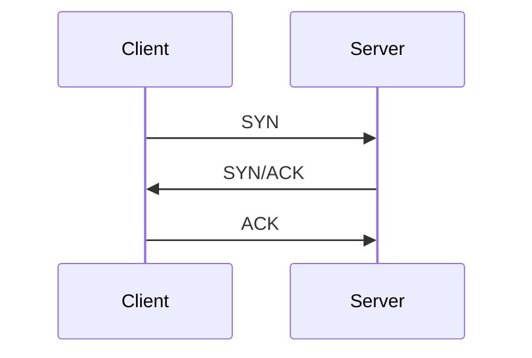
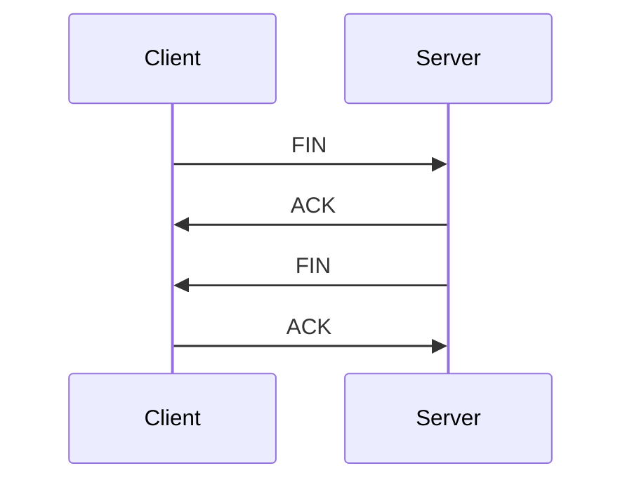
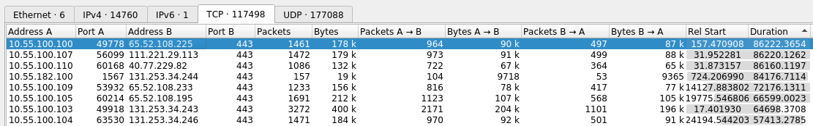
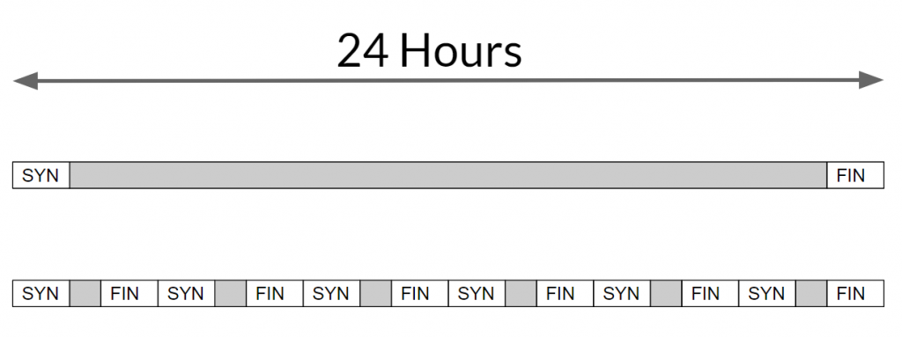

## Goal

Identify the long-lived network connections.

## Tools Used

* Wireshark
* Zeek
* RITA

## Background

To determine how long a connection stays open, we first need to define what constitutes the start or end of a connection.

For TCP, a typical connection starts with a 3-way handshake (SYN, SYN/ACK, ACK) and ends with a 4-way handshake (FIN, ACK, FIN, ACK)

__TCP 3-Way Handshake Connection Start__


__TCP 4 -Way Handshake Connection End__


This means that it is easy to tell when a TCP connection starts and ends.  However, stateless protocols (namely UDP) do not have the same property.  There is no official opening to a UDP connection, and the term "connection" can be tricky to apply to UDP at all.  What firewalls and most packet analysis tools do is define a time window (typically 30-60 seconds) during which UDP packets using the same IPs and port numbers are considered part of the same "session". Each time a new packet is seen the session window TCPtimer is reset. This means that a session is considered started when the first UDP packet is seen and ended when no more UDP packets have been seen for the duration of the time window. The terms "session" and "connection" are often used interchangeably.

The following information must remain the same across packets to be considered part of the same session. Though the IP and ports will swap between source and destination depending on which direction the packet is going.
* source and destination IP addresses
* source and destination ports
* protocol

Collectively, these pieces of information are commonly referred to as a 5-tuple and used to distinguish individual sessions.

## Hunt

We're going to find the connections that have been active for the longest amount of time. These could indicate an attacker with a long-lived C2 session.

### Wireshark

Open your pcap in Wireshark. This loads every individual packet in the main window.

Under the Statistics menu select Conversations. The Conversations window summarizes all the packets into "conversations".

Select the TCP tab and sort by clicking on the Duration column. Click it again to sort in decreasing order.



From here you can see which TCP connections were held open for the longest. In the image above we have a connection from 10.55.100.100 to 65.52.108.255 on port 443 (HTTPS) that was open for 86,222 seconds, or 23.95 hours.

Next, select the UDP tab and apply the same sort by clicking on the Duration column twice.


Here we have a UDP packets from 192.168.88.2 to 216.299.4.69 on port 123 (NTP) for a duration of 86,217 seconds, or 23.95 hours.

However, recall the discussion above about how UDP does not have real "start" and "end" times. Some tools will use a time window to determine when a UDP connection ends. We can see that Wireshark most likely does not do this by looking at the second entry. If you take the total duration (86,209) and divide it by the total number of packets sent (6) we see that there was on average a delay of 14,368 seconds (or about 4 hours) between packets. A time window that broad is useless and it is safe to assume that Wireshark is showing us "conversations" with data from the entire timespan of the packet capture.

### Zeek

Be sure to [analyze your pcap using Zeek]() before starting.

Your Zeek logs should include a file called `conn.log`. You can inspect what's in this file using the `head` command.

```bash
head conn.log
```

```bash
#separator \x09
#set_separator	,
#empty_field	(empty)
#unset_field	-
#path	conn
#open	2019-10-16-15-13-09
#fields	ts	uid	id.orig_h	id.orig_p	id.resp_h	id.resp_p	proto	serviceduration	orig_bytes	resp_bytes	conn_state	local_orig	local_resp	missed_bytes	history	orig_pkts	orig_ip_bytes	resp_pkts	resp_ip_bytes	tunnel_parents
#types	time	string	addr	port	addr	port	enum	string	interval	count	count	string	bool	bool	count	string	count	count	count	count	set[string]
1517336042.090842	CW32gzposD5TUDUB	10.55.182.100	14291	10.233.233.5	80	tcp	-3.000158	0	0	S0	-	-	0	S	2	104	0	0	-
1517336042.279652	ComPBK1vso3uDC8KS2	192.168.88.2	55638	165.227.88.15	53	udp	dns	0.069982	61	81	SF	-	-	0	Dd	1	89	1	109	-
```

This isn't very readable on it's own. There are too many columns to display on a single line. Let's use `zeek-cut` to reduce the columns to what we'd like to look at.

```bash
head conn.log | zeek-cut -c id.orig_h id.orig_p id.resp_h id.resp_p proto service duration
```

```bash
#separator \x09
#set_separator	,
#empty_field	(empty)
#unset_field	-
#path	conn
#open	2019-10-16-15-13-09
#fields	id.orig_h	id.orig_p	id.resp_h	id.resp_p	proto	service	duration
#types	addr	port	addr	port	enum	string	interval
10.55.182.100	14291	10.233.233.5	80	tcp	-	3.000158
192.168.88.2	55638	165.227.88.15	53	udp	dns	0.069982
```

This is better, but so far we are only processing the first few lines of the file. Using `cat` instead of `head` will show the entire file scroll by.

```bash
cat conn.log | zeek-cut -c id.orig_h id.orig_p id.resp_h id.resp_p proto service duration
```

```
...
10.55.100.111	57481	172.217.6.2	443	tcp	ssl	105.310590
10.55.100.111	57475	198.160.127.57	443	tcp	ssl	105.614383
10.55.100.107	51651	52.203.62.126	443	tcp	ssl	14.495950
10.55.100.111	57447	54.215.180.145	443	tcp	ssl	109.111123
10.55.100.100	61848	205.204.101.182	80	tcp	-	106.362057
10.55.100.111	57461	172.217.8.198	443	tcp	ssl	107.272461
10.55.100.111	57459	172.217.8.198	443	tcp	ssl	107.268048
10.55.100.111	57448	23.201.85.182	443	tcp	ssl	108.628962
10.55.100.106	60207	65.52.108.188	443	tcp	ssl	2340.397545
10.55.100.111	57477	63.140.32.190	443	tcp	ssl	105.333464
192.168.88.2	123	216.229.4.69	123	udp	ntp	0.048235
```

Next, let's introduce the `sort` command.
* `-n` will sort based on numeric order
* `-r` will reverse the sort so that the largest numbers are at the top
* `-k 7` tells sort to use the 7th column, which is our duration column

```bash
cat conn.log | zeek-cut id.orig_h id.orig_p id.resp_h id.resp_p proto service duration | sort -nrk 7 | head
```

```
10.55.100.100	49778	65.52.108.225	443	tcp	-	86222.365445
10.55.100.107	56099	111.221.29.113	443	tcp	-	86220.126151
10.55.100.110	60168	40.77.229.82	443	tcp	-	86160.119664
10.55.100.109	53932	65.52.108.233	443	tcp	ssl	72176.131072
10.55.100.105	60214	65.52.108.195	443	tcp	ssl	66599.002312
10.55.100.103	49918	131.253.34.243	443	tcp	-	64698.370547
10.55.100.104	63530	131.253.34.246	443	tcp	ssl	57413.278323
10.55.100.111	63029	111.221.29.114	443	tcp	-	46638.510373
10.55.100.108	52989	65.52.108.220	443	tcp	-	44615.165823
10.55.100.106	52918	40.77.229.91	443	tcp	ssl	41206.913035
```

We are piping the contents of `conn.log` into `zeek-cut` which is reducing the number of fields to only show the ones we care about. Next we are using `sort` to sort the lines by the duration. And finally we are using `head` to only show us the top 10 entries.

From here you can see which TCP connections were held open for the longest. In the output above we have a connection from 10.55.100.100 to 65.52.108.255 on port 443 that was open for 86,222 seconds, or 23.95 hours.

Note that the `conn.log` shows connections for TCP, UDP, and ICMP all in the same file. So the above command is giving us the longest connections across all these protocols. If we wanted to filter out and see only the longest UDP connection, we use `grep` before the `sort`.

```bash
cat conn.log | zeek-cut id.orig_h id.orig_p id.resp_h id.resp_p proto service duration | grep udp | sort -nrk 7 | head
```

```
10.55.182.100	63546	96.45.33.73		8888	udp	-	99.087045
10.55.182.100	59685	172.217.8.196	443		udp	-	59.539003
10.55.182.100	63546	96.45.33.73		8888	udp	-	59.322097
10.55.182.100	63546	96.45.33.73		8888	udp	-	56.383127
10.55.182.100	63546	96.45.33.73		8888	udp	-	55.771569
10.55.182.100	63546	96.45.33.73		8888	udp	-	54.537906
10.55.182.100	59690	172.217.4.34	443		udp	-	53.620681
10.55.182.100	63546	96.45.33.73		8888	udp	-	51.529226
10.55.182.100	63546	96.45.33.73		8888	udp	-	51.355111
10.55.182.100	63546	96.45.33.73		8888	udp	-	48.440549
```

Here we can see that the UDP long connection results from Zeek differ from what we get if we use Wireshark. This is because Zeek uses a [1 minute](https://github.com/zeek/zeek/blob/5265613a9ecc9cb09a7c16cbe378a320903fbcd2/scripts/base/init-bare.zeek#L981) inactivity timeout when analyzing a UDP connection, while Wireshark did not use a timeout.

#### Cummulative Long Connections

In some cases, malware might exhibit behavior that is somewhere between a single long connection, or a short, frequent beacon interval. Instead, it might open a connection, hold it open for a period of time (e.g. 30 minutes), and then immediately open another connection, and repeat.

The image below illustrates the difference by showing one single connection held open for 24 hours on top compared to 6 individual connections spread out over the 24 hours.



With this, an attacker is still able to maintain persistent communication for a long period of time but might not show up in the type of long connection analysis we've done so far. The following command will print the cummulative connection time from one IP address to the same destination IP and port.

```bash
cat conn.log | zeek-cut id.orig_h id.resp_h id.resp_p proto duration | awk 'BEGIN{ FS="\t" } { arr[$1 FS $2 FS $3 FS $4] += $5 } END{ for (key in arr) printf "%s%s%s\n", key, FS, arr[key] }' | sort -nrk 5 | head
```

```
10.55.100.100	65.52.108.225	443	tcp	86222.4
10.55.100.107	111.221.29.113	443	tcp	86220.1
10.55.100.110	40.77.229.82	443	tcp	86160.1
10.55.100.109	65.52.108.233	443	tcp	72176.1
10.55.100.105	65.52.108.195	443	tcp	66599
10.55.100.103	131.253.34.243	443	tcp	64698.4
10.55.100.104	131.253.34.246	443	tcp	57413.3
10.55.100.111	172.217.8.198	443	tcp	55728.1
10.55.100.111	111.221.29.114	443	tcp	46658.4
10.55.100.108	65.52.108.220	443	tcp	44615.2
```

`awk` is a powerful scripting tool. However, the syntax starts to get very messy all on one line like this.

* `BEGIN{ FS="\t" }`  - Set the `FS` (field separator) variable to a tab character. This is what is separating columns in our Zeek logs as well as what we want to use in our output. `BEGIN` means this instruction is only executed one time, before any data is processed.
* `{ arr[$1 FS $2 FS $3 FS $4] += $5 }` - Creates an array (named `arr`) and adds up the duration (`$5` is the fifth field, which is our duration). The important part here is that we are using the concatenation of the first four fields (`$1` through `$4`) as our array key. Which means that as long as the source and destination IPs, destination port, and protocol remain the same it will add the duration to the total. `awk` executes this instruction repeatedly for every line of data.
* `END{ for (key in arr) printf "%s%s%s\n", key, FS, arr[key] }` - Here we are looping through all the elements in the array and printing out the results. `END` signifies that `awk` only executes this instruction one time, after processing all the data.

The results we get in this dataset are very similar to the results of overall long connections from the previous section. However, notice that previously there was no long connection from `10.55.100.111` to `172.217.8.198` in our top long connections. But here we can see that there were enough individual connections to bring it into our top 10.

Let's modify our command to:

1. Disregard the destination port and protocol. If two IPs are directly communicating at all, no matter how, we want to know. This will catch cases where malware is switching between multiple ports or protocols on the same IP.
2. Print out the number of connections that contributed to the overall duration. This will help us distinguish entries where there was a single long connection from those which had multiple connections.

<!-- break -->

```bash
cat conn.log | zeek-cut id.orig_h id.resp_h duration | awk 'BEGIN{ FS="\t" } { arr[$1 FS $2] += $3; count[$1 FS $2] += 1 } END{ for (key in arr) printf "%s%s%s%s%s\n", key, FS, count[key], FS, arr[key] }' | sort -nrk 4 | head
```

```
10.55.100.100	65.52.108.225	1	86222.4
10.55.100.107	111.221.29.113	1	86220.1
10.55.100.110	40.77.229.82	1	86160.1
10.55.100.109	65.52.108.233	1	72176.1
10.55.100.105	65.52.108.195	1	66599
10.55.100.103	131.253.34.243	1	64698.4
10.55.100.104	131.253.34.246	1	57413.3
10.55.100.111	172.217.8.198	543	56057.3
10.55.100.111	111.221.29.114	2	46658.4
10.55.100.108	65.52.108.220	1	44615.2
```

We can see that the results didn't change even when we disregarded protocols and ports. However, now we can see that that pair from `10.55.100.111` to `172.217.8.198` had 543 separate connections where the rest of the list had 1 or 2. By dividing 56057 seconds by 543 connections we can see that each connection was open for an average of 103 seconds. If we wanted to investigate further, we could look at these individual connections' timing and duration or even perform some simple statistical analysis like we do in [Beacons]() to see if there is any regularity or patterns in these connections.

### RITA

RITA uses Zeek logs and should give us the same results as looking at the log files directly as we did above. If you haven't already, import your log files as described in the [Basic Tool Usage]() document.

The dataset name in this example is "sample".

```bash
rita show-long-connections -H --limit 10 sample
```

```
+---------------+----------------+--------------------------+----------+
|   SOURCE IP   | DESTINATION IP | DSTPORT:PROTOCOL:SERVICE | DURATION |
+---------------+----------------+--------------------------+----------+
| 10.55.100.100 | 65.52.108.225  | 443:tcp:-                | 86222.4s |
| 10.55.100.107 | 111.221.29.113 | 443:tcp:-                | 86220.1s |
| 10.55.100.110 | 40.77.229.82   | 443:tcp:-                | 86160.1s |
| 10.55.100.109 | 65.52.108.233  | 443:tcp:ssl              | 72176.1s |
| 10.55.100.105 | 65.52.108.195  | 443:tcp:ssl              | 66599s   |
| 10.55.100.103 | 131.253.34.243 | 443:tcp:-                | 64698.4s |
| 10.55.100.104 | 131.253.34.246 | 443:tcp:ssl              | 57413.3s |
| 10.55.100.111 | 111.221.29.114 | 443:tcp:-                | 46638.5s |
| 10.55.100.108 | 65.52.108.220  | 443:tcp:-                | 44615.2s |
| 10.55.100.106 | 40.77.229.91   | 443:tcp:ssl              | 41206.9s |
+---------------+----------------+--------------------------+----------+
```

Note that RITA will lump together TCP, UDP, and ICMP connections as they are in Zeek's `conn.log` and there is no way to separate out results by protocol using RITA.
